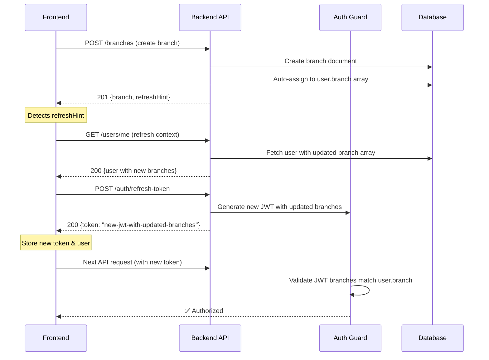

# Branch Auto-Assign - Frontend Integration Guide

## Overview
When a MANAGER creates a new branch, the system automatically assigns that branch to their user account's `branch` array. This guide explains how to integrate this feature in your frontend application.

---

## API Response Format

### Endpoint
```
POST /api/v1/branches
```

### Request Body
```json
{
  "name": "Downtown Branch",
  "city": "Addis Ababa",
  "location": {
    "coordinates": [38.7578, 9.025]
  },
  "phone": "+251911234567",
  "subCity": "Bole",
  "specificArea": "Bole Road",
  "building": "Building 123",
  "isMain": false
}
```

### Response Scenarios

#### 1. Success - MANAGER Role (Auto-Assigned)
```json
{
  "status": "success",
  "data": {
    "branch": {
      "_id": "507f1f77bcf86cd799439011",
      "name": "Downtown Branch",
      "merchant": "507f1f77bcf86cd799439012",
      "branchCode": "BR-002",
      "isActive": true,
      "location": {
        "type": "Point",
        "coordinates": [38.7578, 9.025],
        "city": "Addis Ababa",
        "subCity": "Bole",
        "specificArea": "Bole Road",
        "building": "Building 123",
        "formattedAddress": "Bole Road, Bole, Addis Ababa"
      },
      "createdAt": "2026-09-03T10:30:00.000Z"
    }
  },
  "refreshHint": {
    "code": "BRANCH_ARRAY_UPDATED",
    "message": "Your branch access list has been updated. Your current JWT is stale. Please call /me to refresh your user context or re-login to get a fresh token."
  }
}
```

**What This Means:**
- ✅ Branch created successfully
- ✅ Branch auto-assigned to your user account
- ⚠️ Your JWT token is now stale (contains old branch list)
- 📝 Action Required: Refresh user context before next request

---

#### 2. Success - Auto-Assign Failed (Warning)
```json
{
  "status": "success",
  "data": {
    "branch": { /* branch object */ }
  },
  "warning": {
    "code": "BRANCH_AUTO_ASSIGN_FAILED",
    "message": "Branch created successfully, but could not auto-assign to your access list. Please contact support if you cannot access this branch.",
    "details": "MongoError: Connection timeout"
  },
  "refreshHint": {
    "code": "BRANCH_ARRAY_UPDATED",
    "message": "Your branch access list has been updated. Your current JWT is stale. Please call /me to refresh your user context or re-login to get a fresh token."
  }
}
```

**What This Means:**
- ✅ Branch created successfully
- ❌ Auto-assignment failed (network/database error)
- ⚠️ You may not have access to this branch yet
- 📝 Action Required: Contact support or manually assign via admin panel

---

#### 3. Success - Non-MANAGER Role (No Auto-Assign)
```json
{
  "status": "success",
  "data": {
    "branch": { /* branch object */ }
  }
}
```

**What This Means:**
- ✅ Branch created successfully
- ℹ️ No auto-assign (only MANAGER role gets auto-assigned)
- ℹ️ No JWT refresh needed (your branch list didn't change)

---

## Frontend Implementation

### Step 1: Handle Response After Creating Branch

```typescript
interface BranchCreateResponse {
  status: string;
  data: {
    branch: Branch;
  };
  warning?: {
    code: string;
    message: string;
    details?: string;
  };
  refreshHint?: {
    code: string;
    message: string;
  };
}

async function createBranch(branchData: BranchInput): Promise<Branch> {
  const response = await api.post<BranchCreateResponse>(
    '/api/v1/branches',
    branchData
  );

  const { data, warning, refreshHint } = response.data;

  // 1. Show warning if auto-assign failed
  if (warning) {
    showWarningToast(warning.message);
    // Optionally log to error tracking service
    errorTracker.warn('Branch auto-assign failed', {
      branchId: data.branch._id,
      details: warning.details,
    });
  }

  // 2. Refresh JWT if branch array changed
  if (refreshHint) {
    await refreshUserContext();
  }

  return data.branch;
}
```

---

### Step 2: Refresh User Context

When you receive a `refreshHint`, you MUST refresh the user context to avoid 401 errors on subsequent requests.

#### Option A: Call `/me` Endpoint (Recommended)
```typescript
async function refreshUserContext() {
  try {
    // Fetch fresh user data (including updated branch array)
    const response = await api.get('/api/v1/users/me');
    
    // Update your auth store/context
    authStore.setUser(response.data.data.user);
    
    // Optionally request a new JWT token
    const tokenResponse = await api.post('/api/v1/auth/refresh-token');
    authStore.setToken(tokenResponse.data.token);
    
    console.log('User context refreshed successfully');
  } catch (error) {
    console.error('Failed to refresh user context:', error);
    // Fallback: force re-login
    await forceReLogin();
  }
}
```

#### Option B: Force Re-Login
```typescript
async function forceReLogin() {
  // Clear current session
  authStore.logout();
  
  // Redirect to login page
  router.push('/login?reason=session_expired&message=Please log in again to continue');
}
```

---

### Step 3: Handle 401 Errors Gracefully

Even if you refresh the user context, the backend might reject stale tokens. Add a global error handler:

```typescript
// Axios interceptor example
api.interceptors.response.use(
  (response) => response,
  async (error) => {
    if (error.response?.status === 401) {
      const message = error.response.data?.message || '';
      
      // Check if it's a branch reassignment error
      if (message.includes('reassigned to a different branch')) {
        console.warn('JWT rejected due to branch mismatch. Refreshing...');
        
        try {
          await refreshUserContext();
          // Retry the original request
          return api.request(error.config);
        } catch (refreshError) {
          // Refresh failed, force re-login
          await forceReLogin();
        }
      }
    }
    
    return Promise.reject(error);
  }
);
```

---

### Step 4: Update UI After Branch Creation

```typescript
async function handleCreateBranch(formData: BranchInput) {
  try {
    setLoading(true);
    
    // 1. Create branch (includes auto-assign if MANAGER)
    const newBranch = await createBranch(formData);
    
    // 2. Add to local branches list
    setBranches((prev) => [...prev, newBranch]);
    
    // 3. Show success message
    showSuccessToast(`Branch "${newBranch.name}" created successfully!`);
    
    // 4. Optionally switch to new branch
    if (currentUserRole === 'MANAGER') {
      await switchToBranch(newBranch._id);
    }
    
    // 5. Navigate to branch detail page
    router.push(`/branches/${newBranch._id}`);
    
  } catch (error) {
    console.error('Failed to create branch:', error);
    showErrorToast('Failed to create branch. Please try again.');
  } finally {
    setLoading(false);
  }
}
```

---

## User Context Refresh Workflow



---

## Backend Implementation Details

### Auto-Assign Logic
**File:** `src/modules/branch/service/BranchService.js` (lines 488-541)

```javascript
// Only MANAGER role gets auto-assigned
if (req.user.role?.name === 'MANAGER') {
  try {
    await User.findByIdAndUpdate(
      req.user._id,
      { $addToSet: { branch: branch._id } },  // Atomic, avoids duplicates
      { new: false }
    );
    
    logger.info('branch.create.auto_assign_success', {
      userId: req.user._id.toString(),
      branchId: branch._id.toString(),
      branchName: branch.name,
      merchantId: merchantId.toString(),
    });
  } catch (assignError) {
    // Branch already created; just log warning
    logger.warn('branch.create.auto_assign_failed', {...});
    autoAssignWarning = { /* warning object */ };
  }
}
```

### JWT Validation
**File:** `src/common/guards/auth.guard.js` (lines 109-113)

```javascript
// Check if user's branch array matches token's branches
if (decoded.branch && !branchIdsInclude(currentUser.branch, decoded.branch, decoded.branches)) {
  return next(
    new AppError('You have been reassigned to a different branch. Please log in again.', 401)
  );
}
```

**Function:** `branchIdsInclude()` (lines 34-56)
- Compares JWT's `decoded.branches` array with User's `branch` array
- If arrays don't match (length or IDs), returns `false` → 401 error
- Handles both old single-branch tokens and new multi-branch tokens

---

## Testing

### Manual Testing Checklist

1. **Create Branch as MANAGER**
   - [ ] Branch created successfully
   - [ ] `refreshHint` present in response
   - [ ] User's `branch` array includes new branch ID
   - [ ] Next API request with old token → 401
   - [ ] After refresh → new requests succeed

2. **Create Branch as WAITER**
   - [ ] Branch created successfully (if permitted)
   - [ ] NO `refreshHint` in response
   - [ ] User's `branch` array unchanged

3. **Create 2nd Branch as MANAGER**
   - [ ] No duplicate branch IDs (thanks to `$addToSet`)
   - [ ] Both branches in user's `branch` array

4. **Auto-Assign Failure Scenario**
   - [ ] Branch exists in DB
   - [ ] `warning` object in response
   - [ ] Admin can manually assign later

5. **JWT Staleness**
   - [ ] Old token rejected with 401
   - [ ] Error message: "reassigned to a different branch"
   - [ ] Frontend refreshes context
   - [ ] New token works

---

### Automated Test Example

```typescript
describe('Branch Auto-Assign', () => {
  it('should auto-assign branch to MANAGER and return refreshHint', async () => {
    // Login as MANAGER
    const { token } = await login('manager@example.com', 'password');
    
    // Create branch
    const response = await api.post(
      '/api/v1/branches',
      { name: 'Test Branch', city: 'Addis', location: { coordinates: [38, 9] } },
      { headers: { Authorization: `Bearer ${token}` } }
    );
    
    // Assertions
    expect(response.status).toBe(201);
    expect(response.data.data.branch).toBeDefined();
    expect(response.data.refreshHint).toBeDefined();
    expect(response.data.refreshHint.code).toBe('BRANCH_ARRAY_UPDATED');
    
    // Verify user has branch
    const userResponse = await api.get('/api/v1/users/me', {
      headers: { Authorization: `Bearer ${token}` }
    });
    
    const branchIds = userResponse.data.data.user.branch.map(b => b._id);
    expect(branchIds).toContain(response.data.data.branch._id);
  });
  
  it('should NOT auto-assign branch to WAITER', async () => {
    // Login as WAITER
    const { token } = await login('waiter@example.com', 'password');
    
    // Create branch (if permitted by role)
    const response = await api.post(
      '/api/v1/branches',
      { name: 'Test Branch 2', city: 'Addis', location: { coordinates: [38, 9] } },
      { headers: { Authorization: `Bearer ${token}` } }
    );
    
    // Assertions
    expect(response.status).toBe(201);
    expect(response.data.refreshHint).toBeUndefined();
  });
});
```

---

## Error Handling

### Common Errors

| Error Code | HTTP Status | Meaning | Action |
|------------|-------------|---------|--------|
| `BRANCH_AUTO_ASSIGN_FAILED` | 201 (warning) | Branch created but auto-assign failed | Show warning; user can manually assign |
| `BRANCH_ARRAY_UPDATED` | 200 (hint) | JWT is stale due to branch change | Refresh user context or re-login |
| `JWT_STALE_BRANCHES` | 401 | Token rejected due to branch mismatch | Force re-login or refresh token |
| `PERMISSION_DENIED` | 403 | User lacks permission to create branch | Show error; contact admin |

---

## Migration Guide

### For Existing Frontends

If your frontend currently calls `POST /branches` and expects the old response format:

**Old Response:**
```json
{
  "status": "success",
  "data": {
    "branch": { /* branch object */ }
  }
}
```

**New Response:**
```json
{
  "status": "success",
  "data": {
    "branch": { /* branch object */ }
  },
  "refreshHint": { /* optional */ },
  "warning": { /* optional */ }
}
```

**Migration Steps:**

1. **Update Response Type** (TypeScript)
   ```typescript
   interface BranchCreateResponse {
     status: string;
     data: { branch: Branch };
     warning?: Warning;        // NEW
     refreshHint?: RefreshHint; // NEW
   }
   ```

2. **Handle New Fields** (Backward Compatible)
   ```typescript
   const response = await api.post('/branches', data);
   const { branch } = response.data.data;
   
   // NEW: Handle optional fields
   if (response.data.warning) {
     showWarning(response.data.warning.message);
   }
   
   if (response.data.refreshHint) {
     await refreshUserContext();
   }
   ```

3. **Test Incrementally**
   - Deploy backend changes first
   - Old frontend will ignore new fields (backward compatible)
   - Update frontend to handle new fields
   - Test with both MANAGER and non-MANAGER roles

---

## FAQ

### Q: Why does my JWT become stale after creating a branch?
**A:** When you create a branch as a MANAGER, the backend auto-assigns it to your `user.branch` array. Your current JWT token was issued BEFORE this change, so it contains the OLD branch list. The auth guard compares the token's branch list with your current user document's branch list. If they don't match, the guard rejects the token with a 401 error.

### Q: Do I need to handle `refreshHint` manually?
**A:** Yes. The backend does NOT automatically issue a new token (by design, per Decision 3 in `BRANCH-AUTO-ASSIGN-DESIGN.md`). You must either call `/me` to refresh user context and then `/auth/refresh-token` to get a new JWT, or simply re-login.

### Q: What if I ignore the `refreshHint`?
**A:** Your next API request will fail with a 401 error: `"You have been reassigned to a different branch. Please log in again."` The frontend's axios interceptor should catch this and force a re-login.

### Q: Why only MANAGER role?
**A:** Per design decision #1, only users with operational oversight (MANAGER role) get auto-assigned. This prevents unintended access if permissions are later tightened. Other roles (WAITER, KITCHEN) must be manually assigned by a manager.

### Q: Can I configure which roles get auto-assigned?
**A:** Currently hardcoded to `'MANAGER'`. Future enhancement could introduce a config constant `BRANCH_ADMIN_ROLES = ['MANAGER', 'SUPER-MERCHANT-ADMIN']`.

### Q: What happens if auto-assign fails?
**A:** The branch is still created (no rollback). You'll receive a `warning` object in the response. The user can be manually assigned later via the admin panel. This is per design decision #2 (partial success + warning).

### Q: How do I manually assign a branch to a user?
**A:** Use the new endpoints (added in seeder):
```
POST /api/v1/users/:userId/branches
Body: { "branchIds": ["507f1f77bcf86cd799439011"] }
```

---

## Related Documentation

- **Design Decisions:** `BRANCH-AUTO-ASSIGN-DESIGN.md`
- **Implementation Summary:** `BRANCH-AUTO-ASSIGN-COMPLETE.md`
- **Auth Guard Logic:** `src/common/guards/auth.guard.js`
- **User Model:** `models/userModel.js`
- **Multi-Branch Testing:** `tests/multi-branch-user-access.test.js`

---

## Support

If you encounter issues:
1. Check backend logs for `branch.create.auto_assign_*` events
2. Verify user's role is MANAGER: `GET /api/v1/users/me`
3. Inspect JWT payload: decode token at [jwt.io](https://jwt.io) and check `branches` array
4. Contact backend team with user ID, branch ID, and timestamp

---

**Last Updated:** 2026-09-03  
**Version:** 1.0.0
